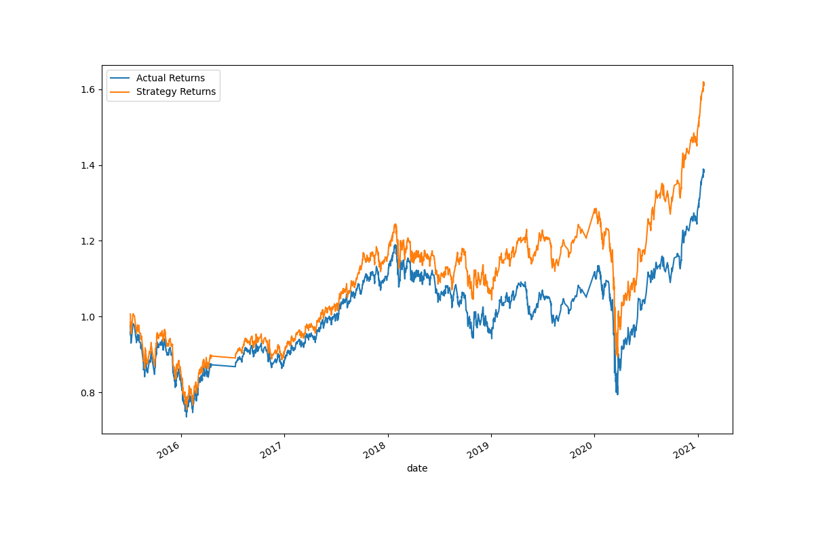
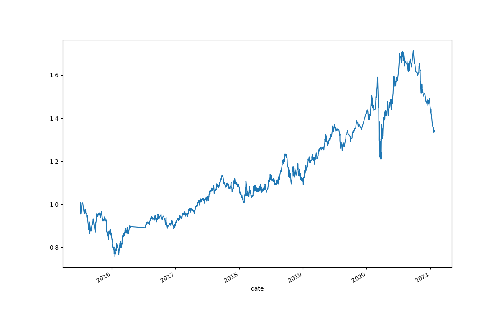

# Algorithmic Trading Evaluation Report

## Data Overview

OHLCV (Open, High, Low, Close, Volume) data for emerging markets from 2015-01-21 to 2021-01-22 are included in the dataset. The data was read into a pandas DataFrame, analysed, and then the "Actual Returns" and "close" prices were calculated.

To be used as trading indicators, two simple moving averages (SMA) were computed using short (4-period) and long (100-period) frames. A buy signal was generated (1) when the Actual Return was more than or equal to 0, and a sell signal (-1) when the Actual Return was less than 0. These SMA values were utilised to create trading signals.

Finally, 'Strategy Returns' were computed by multiplying 'Actual Returns' by the shifted 'Signal' column.

## Training and Testing Split

A training set was created from the data, which included the first three months of data from the start date, and a testing set. The target variable for the model was the trading "Signal," and features for it were the fast and slow SMAs. To make sure all features contribute equally to the model performance, the feature data was scaled using the `StandardScaler` from `sklearn.preprocessing` before the model was applied.

## Model Selection and Performance

The model for this job was chosen using `SKLearn's support vector machine (SVM)` learning technique, namely the `Support Vector Classifier (SVC)`. SVC is a reliable and adaptable model that is appropriate for classification assignment. Using the training data, the model was fitted, and the testing data was used to generate predictions.

## Future Steps

Reviewing the predictions provided by the SVC model, assessing the model's performance using suitable metrics (such as accuracy, precision, recall, and F1-score), and contrasting these metrics with the baseline performance set earlier would be the next steps in this process. Visualisations of the expected versus actual returns may also offer insightful information.

Additionally, model tuning could be done to enhance the functionality of the SVC. This would entail changing a number of SVC model parameters.

The end result of this investigation is to create a trading strategy that performs better than the baseline. Such a technique might be tested using out-of-sample data or using a paper trading approach to determine its effectiveness.

## Charts

In the charts below, we can observe the differewnce between the original and the new model created using `AdaBoostClassifier`

## Cumulative Actual Returns vs Cumulative Strategy Returns

## Cumulative Actual Returns vs Cumulative Strategy Returns for New Model

